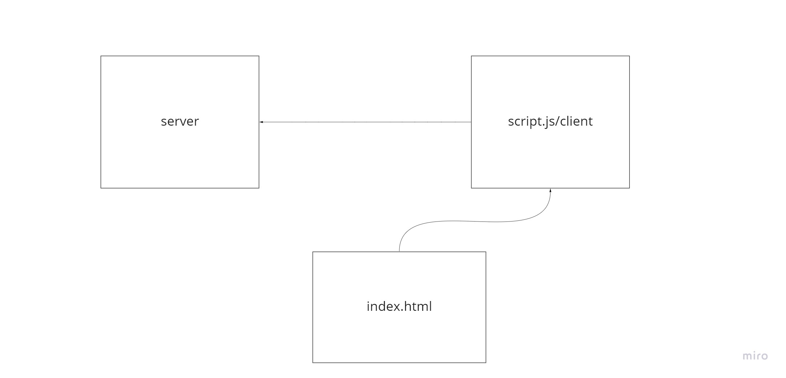

# Message-app

## chat app

*this app name is shat app which it send message and choose room to send a message also.*

**to create this app i did use**
+ soket.io
+ soket.io-client
+ @socket.io/admin-ui
+ https://admin.socket.io

you can use this app by open the `http://localhost:5500/client/?` in your web by make sure that the server is working.

## UML

